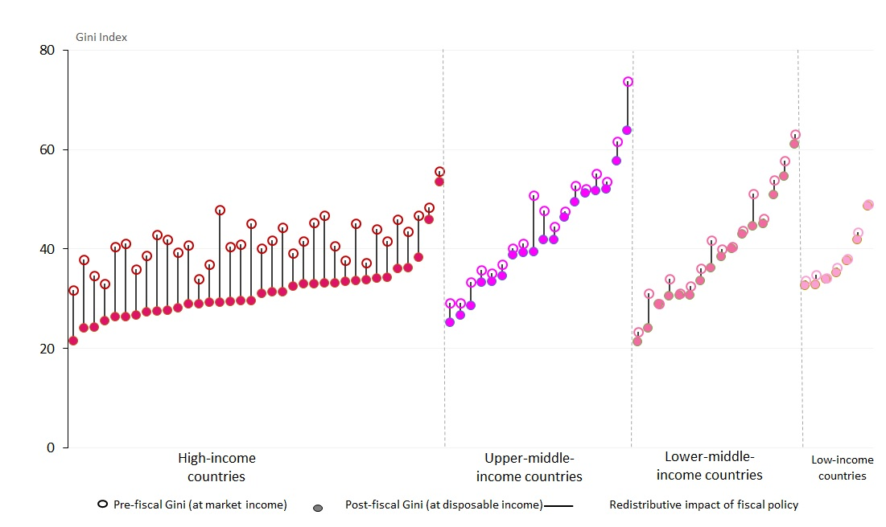
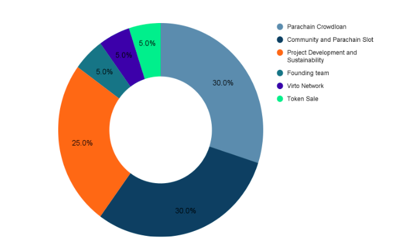

# Local Incentives Protocol
### Decentralized Marketplace Infrastructure 

## 1. Introduction

Fiat money gives central banks huge control over the economy, an alerting
thought since it is extensively used in all human trading activities. Risks have
been observed in a number of countries as hyperinflation resulted from huge
increases in the supply of paper money, e.g. currency instability in Venezuela
that began in 2016. Since the launch of Bitcoin in 2009, cryptocurrencies are
not yet considered as mainstream currency in payment systems in exchange for
common goods or services, e.g. a pizza, a painting, a house and so on. To
fulfill this demand, Virto Network creates the Local Incentives Protocol(LIP)
which defines a secure payment system and means to trade off-chain assets with
cryptocurrency by connecting decentralized markets and users, LIP facilitates a
better local welfare redistribution through local tax collection from economic
activities.

Why? We live in a modern 21st century yet inequality still persists, whether in
income, wealth, opportunities or other dimensions. Some of the most effective
mechanisms governments have for reducing economic inequalities are taxes, cash
and in-kind transfers. However these fiscal policies that help shape more
equitable societies play a small role in low-income countries. 

 

Through historical perspective, we observe the limitations of the current
government taxing system to resolve economic inequality Fairness: Tributed local
resources are managed by people with different interests Efficiency: Redundant
intermediaries and bureaucratic bodies cost time and money Transparency: If
people can’t track and feel the benefit of the spending process it lowers the
trust in the system Therefore we believe that LIP enables connected
decentralized marketplaces to empower autonomous local communities by letting
people and local communities be in control to collect and spend local tax in a
fair, efficient and transparent way. Built around the protocol, Virto Network
provides Marketplace builders developer friendly API’s to help them build secure
& highly scalable decentralized dApps so they can focus on solving the real
problems.(link)

## 2. Local Incentives Protocol

Local Incentives Protocol enables people to create stronger communities with
aligned interests, to transact securely for goods and services in all kinds of
decentralised marketplaces and to receive incentives through local tax
collection to solve community problems in a fair, efficient and transparent way.
All are enforced by blockchain technology. 

### 2.1 Key actors

- Buyers/Customers: Anyone effortlessly joining the network in a trustless way
  that wants to buy goods or services from any other user.
- Sellers/Merchants: More experienced users trading their real world assets and
  services in exchange for cryptocurrency.
- Community: People sharing a physical space who are incentivised to create
  communities and unlock existing and future resources which are collected from
  every trade with a local tax. Communities as DAOs decide to spend resources
  based on their needs to create powerful autonomous micro-economies
- Marketplace: different marketplaces, e.g. e-commerce, are connected into the
  system and get gains called market fee from every successful and secure trade.
  Local tax is collected and locked at the geo land cells where each trade
  happens
- Union: Community and Marketplace could together form union, as a higher level
  DAOs to make decision to tackle global level topic 

### 2.2 Process

The world is divided into geo land cells. Each geo land cell represents around 5
km2. When an individual creates an account, they’re attached to a geo land that
they select.

Individuals have two means of trading, through P2P or marketplace.  
- In p2p trading mode, individuals could freely trade as buyer and seller 
- When trading in marketplace, individuals could either connect through markets as selected
qualified sellers to sell or as buyers to buy

Therefore, individuals can freely trade with each other or in a regulated
marketplace through a secure payment system embedded in the protocol, which
enables cryptos as payment method for service and offchain assets. For the trade
in the marketplace, the marketplace receives market fees in their native token
format as the cost of their service, which encourages new marketplace to join
the system by creating applications to serve the demands.

For every trade within the system, system fee is charged to secure the network
and prevent abusive usage, quantity of which is rather minimal. Besides, a
certain percent of the price is collected as local tax, which is directly locked
in the geo land cells as potential assets for future community. To form a
community, individuals need to union together to pass threshold for both the
total staking capitals and the total amounts of individuals. The system allows
native token Kusama staking and earning not only Kusama token staking reward but
also land tokens. Land tokens could be freely traded and collected for further
governance. Due to the accumulated local tax, people are incentivized to create
communities with their peers, bonding assets to unlock existing and future
resources that are collected in the cells from trading activity. Besides, the
system fee collected also belongs to local communities. These communities will
become DAOs and decide to spend resources based on their needs to create
powerful autonomous micro-economies. Communities could decide about their own
governance system to better facilitate their economy in a dynamic way.

Communities or marketplaces could form a union with either communities or
marketplaces to join forces to solve global problems, e.g. climate change. They
could establish a decision model by voting and allocate certain resources on the
focus.

### 2.3 Applications

Marketplaces are applications that connect to LIP for users directly to interact
with. All sorts of economic activities can take place in the marketplaces. The following 
are reference applications developed by the core team to showcase. More applications in 
the future could be developed by builder teams.

- Swap.cash: Decentralized on & off ramps, which enables an easy exchange between
fiat money and crypto currencies 
- Flea.market: P2P trade of local goods 
- Go.delivery: Deliveries without intermediaries

## 3 Infrastructure

## 4 Governance 

In the beginning, the LIP is governed mainly by the founding
team which aims to function as a benevolent dictatorship to set up the initial
system and maximize overall welfare and efficiency. 

When more and more marketplaces, communities are formed, each of them will form
their own governance structure within the marketplaces or community to achieve
an autonomy, democratic and self-sufficient political economic system. Each
marketplace has its own marketplace token while all communities use the LIP
land tokens. The overall LIP system is governed by marketplaces, communities and
founding teams together with a joint force. From this moment till the future,
initial design expects the founding team’s governance power to get smaller until
in the end be only sufficient to maintain the system operation while
marketplaces, communities continue to increase their governance power time by
time.

 

## 5 Economics 

1. Native Token: Our chain uses Kusama as our native token, which follows Kusama
Network governance and distribution. We allow staking with Kusama for
participants to get rewards. 
2. Land Token: Land token is the NFT within LIP representing the geo land. On
each community level, the total geo land cell that represents a single community
is around 5 km2, derived from level 7 of H3([Hexagonal hierarchical geospatial
indexing system](https://h3geo.org/)) [Resolution](https://h3geo.org/docs/core-library/restable/). The higher level it goes, the land size is divided
by 7 until level 13 which represents around 43.9m2. These minimal land units
represent 1 unit of the land token. Therefore each community holds around 117.6K
land tokens within the 5 km2 geo cell.
3. Marketplace Token: Each marketplace that connects to LIP can mint their own
tokens by enabling their services. They also establish their own governance
system and token economics. For every trade in the marketplace, the marketplace
token is charged as local tax and locked within the land cell.

### 5.1 Land Token
#### 5.1.1 Key Functions
- Network Utility Token: Land token is a
tradable NFT token, and also utilized in reward for staking and other network
activities.  
- Community Governance Token: As a governance token, land tokens
provide their holders voting rights in community level and chain level
governance.

#### 5.1.2 Minting and Distribution
The total 117.6K( =76) land tokens of each community is minted starting from 
time 0. The speed of token minting is rather slow in the beginning and getting faster and then slows down
shown below.  In each period, the total staking capital decides the chance for
the individual to get the land token, usually higher staking capitals, higher
chance until reaches a certain threshold, the winning chance no longer
increases. The mechanism tried to increase fairness by preventing early birds
and whales’ absolute advantage and monopoly governance. 

 
 
 

### 5.2 Marketplace Token
#### 5.2.1 Key Functions
- Network Utility Token: Marketplace token is a native fee token for each 
marketplace and is also utilized in network activities, e.g. crowdloan rewards.
- Community Governance Token: As a governance token, marketplace tokens provide 
their holders voting rights within the marketplace and chain level governance.

#### 5.2.2 Minting and Distribution
Markerplaces are free to design their own token economics with two conditions of
the token allocations:

- Virto Network: >= 5% of total tokens supply 
- Parachain Crowdloan: >=10% total tokens supply
. Below is the example 

For the team's reference applications, e.g. Swap.cash, the total supply of marketplace tokens will 
be minted at the launch of the marketplace project and stored to be distributed 
for:

- Parachain Crowdloan: 30% to raise KSM needed for a crowdloan to bid in the 
Kusama parachain auction for an initial 48-week year parachain slot. Upon launch
 of the Virto parachain, these tokens will be distributed immediately to the crowdloan 
contributors
- Community and Parachain Slot: 30% to secure future Kusama parachain slot leases
  and other community initiatives
- Project Development and Sustainability: 25% to support projects, ecosystem 
development, maintainence and other network needs.
- Founding team: 5% to reward founders and core development team
- Virto Network: 5% to secure and sustain Virto Network 
- Token Sale: 5% to pre-sell to early backers and contributers

### 5.3 Parachain Auction

We plan to launch our mainnet on a Parachain slot within the Kusama network. To
increase the chance of winning, marketplaces distribute their predefined crowdloan share of   
tokens to our crowdloan supporters who locked their Kusama to support us. We will
distribute land tokens as rewards to Kusma owners who participate in our first
auction successfully to compensate for their opportunity costs of having their
Kusamas locked for 12 months.
